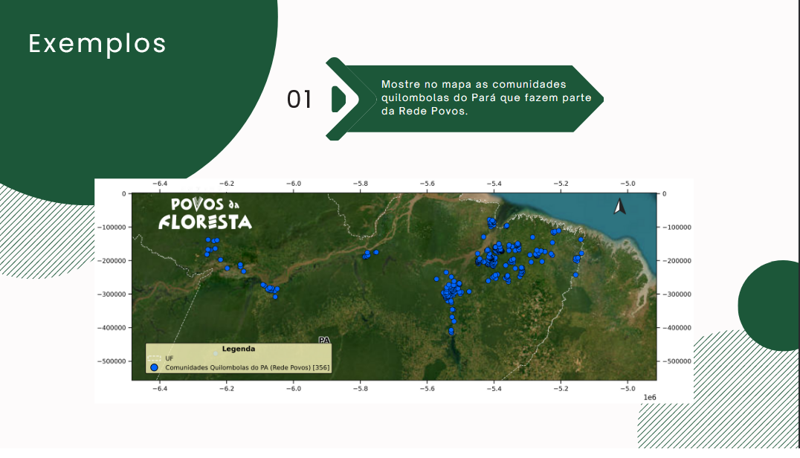
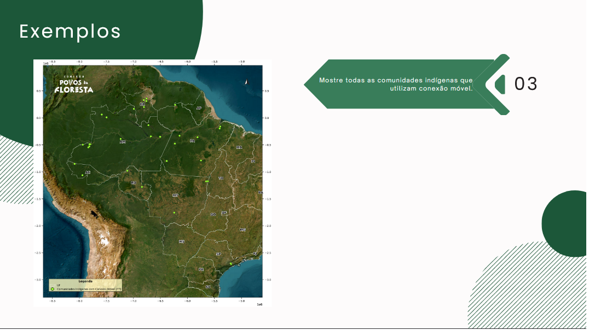
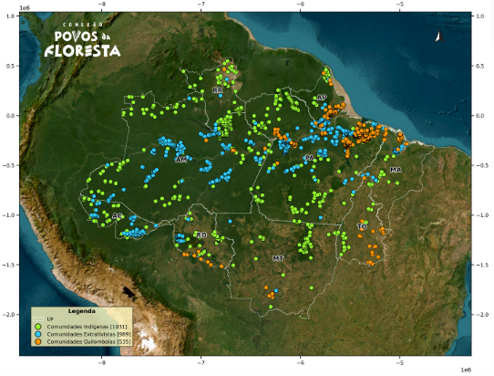
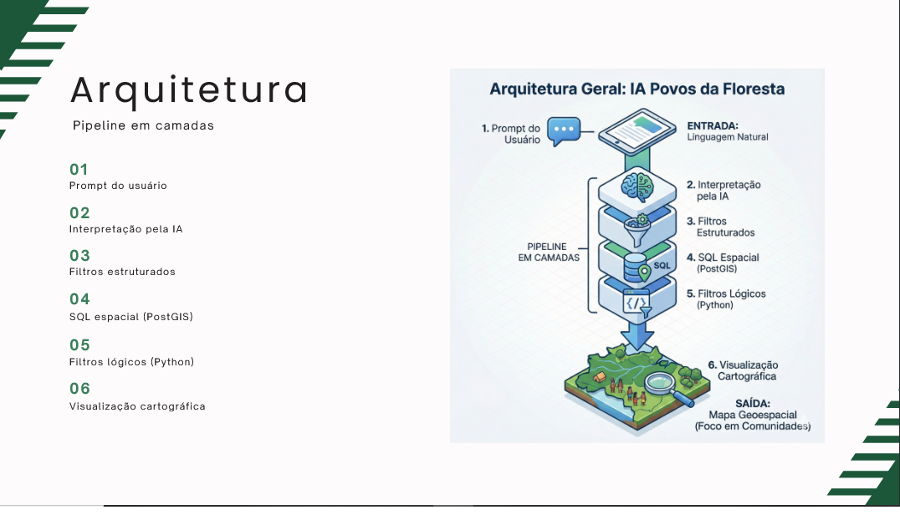

# Prompt-to-Map

Generate geospatial maps directly from natural language using Large Language Models (LLMs).

This project demonstrates an AI-driven system capable of interpreting user prompts, transforming them into structured filters, querying geospatial datasets and generating thematic maps automatically.

The system was designed with a strong focus on:

- clear architectural separation
- predictable behavior
- traceable decision logic
- consistency with official datasets

---

# Example Maps

Example outputs generated by the system.







---

# How the System Works

The system transforms natural language into geospatial queries through a structured pipeline.

User Prompt  
↓  
LLM Interpretation  
↓  
Structured Filters (JSON)  
↓  
Geospatial Query (Spatial Dataset)  
↓  
Business Logic Filters (Python)  
↓  
Map Rendering  

This architecture allows complex spatial queries to be executed without requiring the user to know SQL or GIS tools.

---

# System Architecture



The system is organized in three main layers:

### AI Interpretation Layer

Responsible for translating natural language into structured commands.

The AI:

- interprets user intent
- generates structured JSON filters
- does **not access databases**
- does **not generate maps**

---

### API Orchestration Layer

The API coordinates the workflow.

Responsibilities:

- receive user prompts
- validate AI output
- apply logical filters
- validate query results
- decide whether to generate a map or return feedback

Technologies used:

- FastAPI
- Pydantic
- Uvicorn

---

### Processing and Visualization Layer

Responsible for generating thematic maps from filtered data.

Characteristics:

- generates PNG maps
- uses geospatial datasets
- does not interact with the AI
- does not validate business logic

---

# Natural Language to Structured Query

Example transformation.

Prompt:


Show indigenous communities in the Amazon with health working groups


AI Output:

```json
{
  "community_type": "indigenous",
  "region": "amazon",
  "working_group": "health"
}

This structured representation allows the backend to apply deterministic filtering rules.

Logical Filters

The system applies two types of filters.

Spatial Filters

Executed directly on spatial datasets.

Example:

region = "Amazon"
state = "PA"
Business Logic Filters

Implemented as composable Python functions.

Example rule:

Has Energy Kit =
OffGrid Kit OR Backup Kit

This allows domain-specific logic to be represented even when it is not explicitly stored in the dataset.

AI Behavior Testing

Different scenarios were designed to evaluate the system.

Example cases include:

Vague request

generate a map

The system generates a default map and suggests refinements.

Complex multi-layer request

show indigenous communities without internet in red and quilombola communities with internet in blue in the northeast

The system generates multiple layers with different filters.

Impossible request

show starlink antennas in tokyo

The system detects geographic inconsistencies and returns explanatory feedback.

Technologies Used

Python

FastAPI

GeoPandas

Matplotlib

Spatial datasets

Large Language Models (LLMs)

Documentation

Technical documentation available in this repository.

Technical manual:

docs/manual_tecnico.pdf

AI test scenarios:

docs/teste_de_stres.pdf

Notes on Data

The original datasets used in this project are institutional and cannot be publicly shared.

This repository focuses on:

system architecture

AI design

filtering logic

map generation workflow

Author

Malu Bittencourt

Software Developer | AI Systems | Geospatial Data